# 05 — User Flows

## First launch
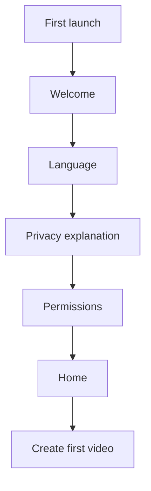

## First successful video
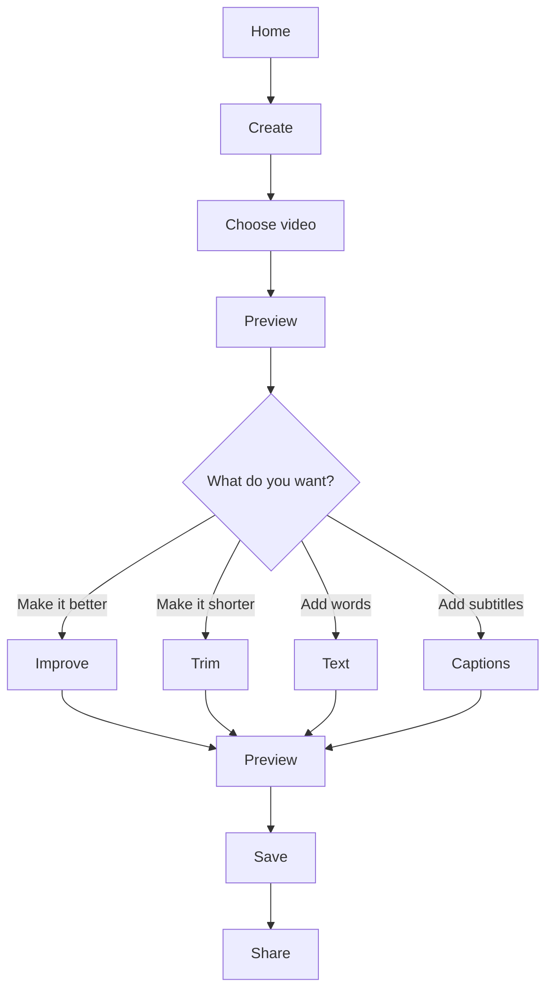

## Import
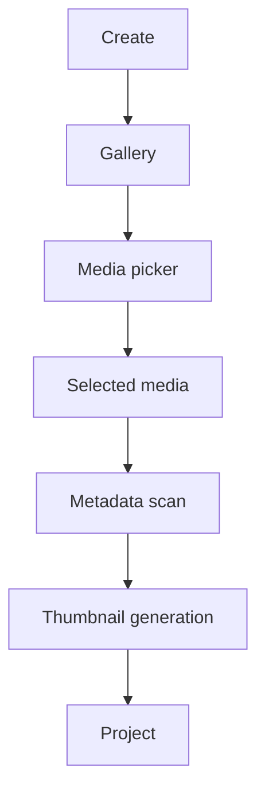

## Camera
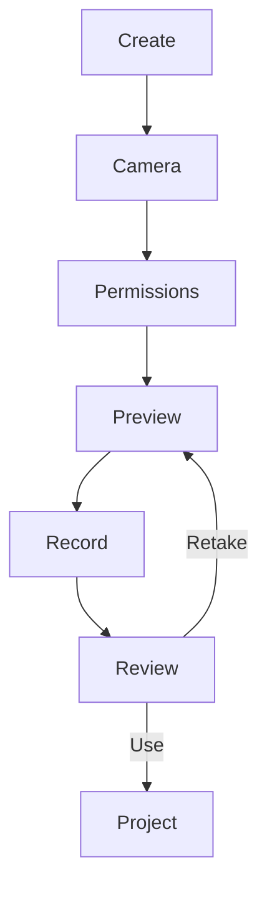

## AI improvement
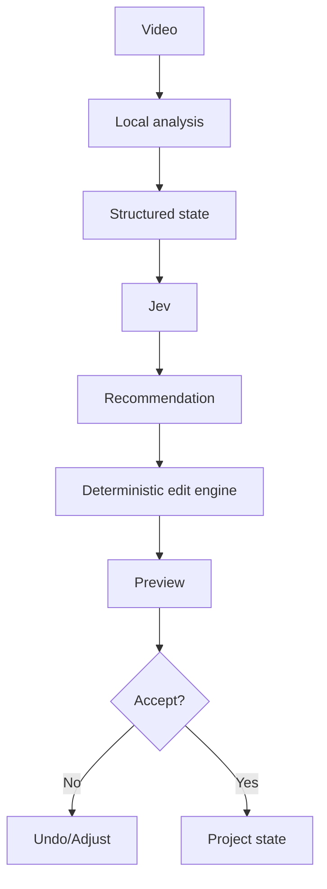

## Export
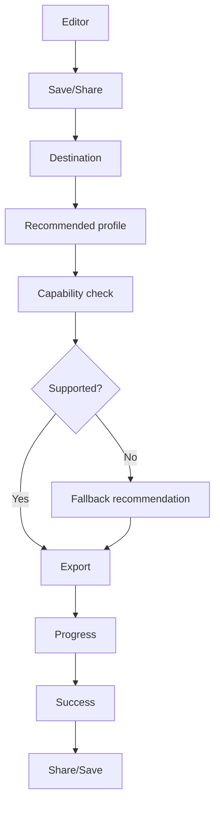

## Template
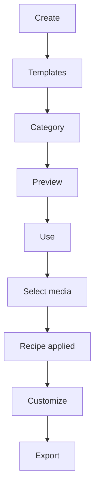

## Offline
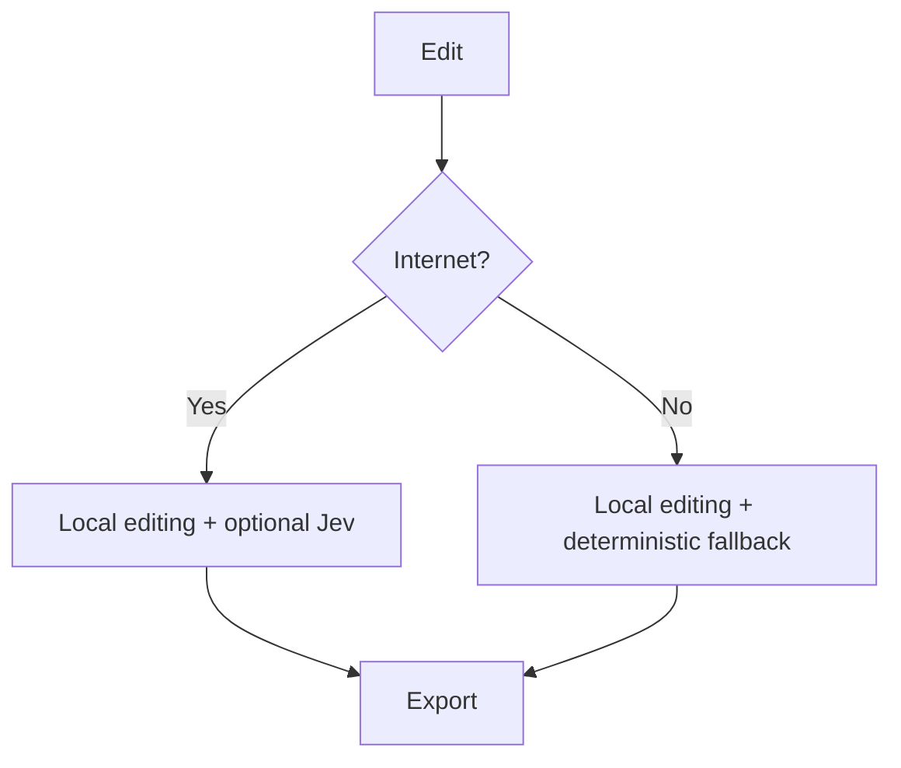

## Future automatic short
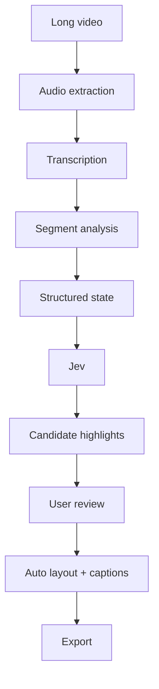

# Future Creative Studio Flows

## Poster from a simple request
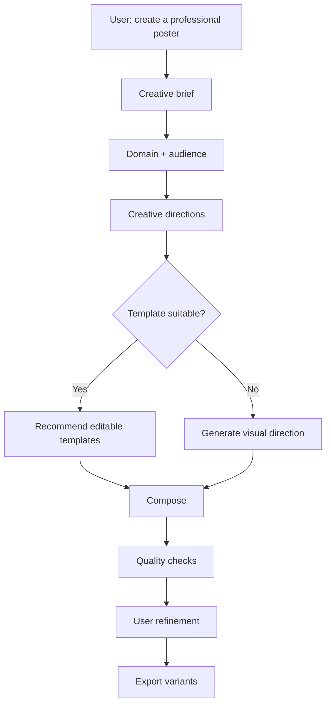

## Story to finished campaign
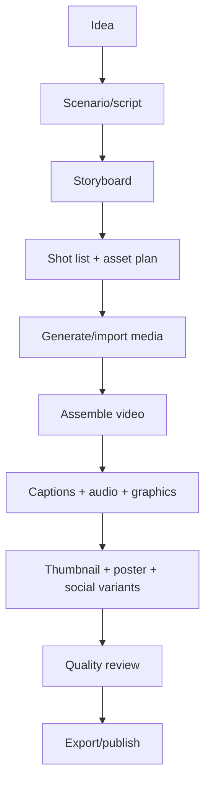

## AI creative team
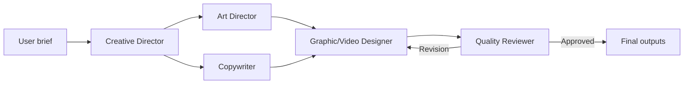
